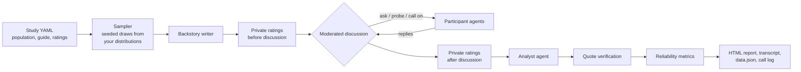
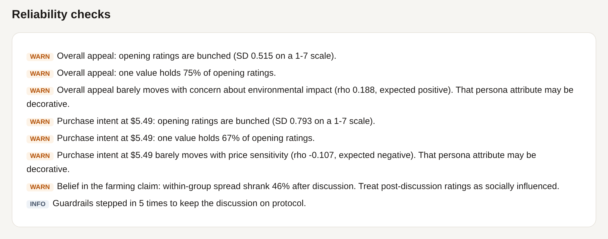

# synthetic-focus-group

A multi-agent focus group that runs on language models, and tells you how far to trust it.

An AI moderator runs a discussion guide with a panel of persona agents drawn from a population you define. It probes vague answers, calls on quiet participants, and looks for disagreement. An analyst agent then writes up the findings. Throughout the session, the system measures the failure modes synthetic respondents are known for: answers that cluster near the middle, personas whose traits don't actually affect their answers, groups that pull everyone toward one opinion, and quotes nobody said.

```bash
pip install -e ".[anthropic]"          # or ".[openai]" / ".[all]"
sfg run examples/oat-milk-concept.yaml --mock      # full pipeline offline, no API key
sfg run examples/oat-milk-concept.yaml --quick     # cheap live preflight: 3 people, 1 topic
sfg run examples/oat-milk-concept.yaml             # the real thing
```


<sub>From a live run with Claude (Sonnet 5 as moderator and analyst, Haiku 4.5 as participants). The full report is in [`docs/sample-report.html`](docs/sample-report.html); download it and open it in a browser.</sub>

---

## Why this exists

Recruiting a real focus group takes weeks and a budget. Language models can play participants in minutes, and that is useful for stress-testing a concept, sharpening a discussion guide before fieldwork, or exploring a segment you can't easily reach.

Synthetic respondents also fail in predictable ways. Most tools ignore those failures, which leaves you with confident-sounding output and no way to check it. This project treats reliability as a feature. Every run comes with its own diagnostics.

## How it works



1. **Sampling.** Every attribute (age, income, habits, attitudes) is drawn in code from distributions in the study file, using a fixed seed. The model is never asked to "invent a diverse person." Left to themselves, models tend to produce the same few archetypes, and the sample would stop matching the population you specified.
2. **Personas.** A backstory model adds texture on top of the sampled attributes. Backstories describe each person's life before the session and only mention the product category, never the concept being tested, so nobody arrives already sold on it. Attitude attributes, such as price sensitivity on a 1 to 7 scale with labeled endpoints, are marked as *fixed*. They are restated to the participant on every turn so they don't drift toward the polite, middle-of-the-road answer models default to.
3. **Private ratings, twice.** Participants read the concept up front and each rates it privately before anyone speaks. After the discussion they rate again, this time with the full discussion in front of them and a reminder of their own first answer. Because the second card knows what was said and what they said before, a changed answer reflects the conversation rather than random variation.
4. **Moderated discussion.** The moderator agent picks one action per turn from a fixed set: `ask_group`, `ask_participant`, `probe`, or `next_topic`. Each participant sees only their own group's conversation, plus a reminder of what they said earlier, so they stay consistent across topics.
5. **Analysis.** The analyst agent writes themes with supporting quotes. Every quote is checked against the transcript word for word, and any that don't match are removed and counted.

### The model decides, the code guarantees

| The moderator model decides | The code guarantees |
|---|---|
| What to ask, whom to probe, when a topic feels covered | Every participant is heard on every topic |
| How to phrase questions and transitions | Each topic ends within its turn budget |
| Which answers deserve a follow-up | Unknown participant names never break the session |
| What the themes are | Every quote in the report was actually said, by that person |

Each time a guardrail overrides the model, the event is logged and shown in the report.

## Reliability checks

| Failure mode | What it looks like | How it's measured |
|---|---|---|
| **Answers cluster near the middle** | Twelve people who look different on paper all answer "4" | Spread of opening ratings and the share taken by the most common answer. With real survey data supplied: the ratio of synthetic to human spread, and the distance between the two distributions |
| **Traits that don't matter** | Price-sensitive personas are as keen on a premium product as anyone else | For each link you predict in the study file (e.g. *price sensitivity lowers purchase intent*), the rank correlation between the trait and the opening rating |
| **Group pull** | Everyone converges after hearing the loudest voice | How much each group's spread shrinks from before to after the discussion, and the share of people who changed their answer |
| **Quotes nobody said** | The analyst tidies up a quote or attributes it to the wrong person | Word-for-word matching of every quote against what that participant actually said |

The thresholds are heuristics that flag a run worth a closer look. They are not significance tests.

## What the first live runs showed

The first live runs are the best evidence that the reliability checks earn their place, because they caught real problems the rest of the report would have hidden.

**Run 1 (baseline).** The discussion read well. The moderator probed specifics ("You said it feels like they're banking on people feeling guilty. Can you say more?") and noticed early consensus. But the checks flagged 7 problems:

- 75% of participants gave the same answer on belief in the farming claim.
- Price sensitivity barely affected purchase intent (rho -0.20), and skepticism barely affected belief in the claim (rho -0.11). The personas' attitudes were decorative.
- The analyst produced 2 quotes nobody said. They were caught and removed.

The transcript showed why. When the moderator asked the whole group a question, each person heard the earlier answers before giving their own, so the first speaker set the frame and everyone echoed it. The clearest case was Omar. His sampled attitudes (low price sensitivity, high environmental concern, low skepticism) made him the natural buyer, yet he opened with "I'm with Owen and Yuki."

**The fix.** Real moderators handle this with a technique called nominal group: everyone writes down a first reaction before anyone speaks. Group questions now work the same way. Everyone answers from the same starting point, and reactions to each other come on the follow-ups. Each participant's fixed attitudes are also restated on every turn and rating card, replies are capped at about 60 words with an instruction to add something new rather than agree, and the moderator was told that coverage is guaranteed by code, so its turns should go to depth.

**Run 2.**

| | Run 1 | Run 2 |
|---|---|---|
| Median reply length | 109 words | 54 words |
| Invented quotes removed | 2 | 0 |
| Belief in the claim tracks skepticism (rho) | -0.11 | -0.97 |
| Share giving the most common answer on belief in the claim | 75% | 42% |
| Purchase intent tracks price sensitivity (rho) | -0.20 | -0.11 |
| Participants who changed their answer after discussion | 92 to 100% | 92 to 100% |
| Input tokens (Haiku / Sonnet) | 663k / 182k | 484k / 127k |

Omar now behaves like the person he was sampled to be. His opening ratings were the highest in the room, and he broke from the group out loud: "Here's where I'm different... the rest of you seem to need it cheaper first; I just need the data first."

**What didn't improve.** Group pull is still strong. After reading a mostly skeptical transcript, every participant lowered their ratings, Omar included, even though he'd just said he would pay the premium with proof. Language models defer to a clear majority, and prompting alone didn't fix that. Price sensitivity also still doesn't move purchase intent. And the strong result on claim belief may be partly built in, since rating cards now restate each person's skepticism score. These are open problems, and the report flags them on every run rather than hiding them.




## Quickstart

```bash
git clone https://github.com/dualduel/synthetic-focus-group
cd synthetic-focus-group
python -m venv .venv && source .venv/bin/activate
pip install -e ".[all,dev]"

sfg validate examples/oat-milk-concept.yaml     # check the study file
sfg personas examples/oat-milk-concept.yaml     # preview the sample: free, no model calls
sfg run examples/oat-milk-concept.yaml --mock   # offline end-to-end run

cp .env.example .env                            # add ANTHROPIC_API_KEY or OPENAI_API_KEY
sfg run examples/oat-milk-concept.yaml --quick  # preflight: every agent, a few cents
sfg run examples/oat-milk-concept.yaml --provider anthropic
sfg run examples/oat-milk-concept.yaml --provider openai --groups 1 --size 5
```

Each run writes a folder under `runs/`:

| File | Contents |
|---|---|
| `report.html` | Self-contained visual report: findings, rating distributions, reliability checks, participants, transcripts, method |
| `report.md` | The same findings in Markdown |
| `transcript.md` | Full speaker-labeled transcript, including guardrail interventions |
| `data.json` | Everything structured: personas, ratings, turns, analysis, metrics, token usage |
| `calls.jsonl` | Every model call with its prompt, response, model, and latency |

Always do a `--quick` preflight before a full run. It runs one group of 3 through the first topic, including the analyst, so a wrong model name, a missing key, or a token-limit problem shows up for a few cents instead of after hundreds of calls.

The example study (2 groups of 6, 4 topics) makes about 260 model calls. Most go to the smaller participant model. Backstories and private ratings run in parallel. After each run, the terminal and the report's Method section show calls and tokens per model, so you can see what the run cost. The run folder is created as soon as a run starts and its call log fills in live, so you can watch progress with `wc -l runs/*/calls.jsonl`. If a run fails partway (for example, a mistyped model name or a rate limit), the folder is kept with a `-failed` suffix so you can see exactly where it stopped. The `.env` file is found in the current directory or next to the study file.

## Writing a study

A study is one YAML file. See [`examples/oat-milk-concept.yaml`](examples/oat-milk-concept.yaml) for a complete one.

```yaml
title: Oatlight Barista concept test
objective: Find out whether weekly milk buyers would switch to a premium oat milk...
category: milk and plant-based milk, especially for coffee at home   # used for backstories
stimulus: Oatlight Barista is a new oat milk made for coffee...        # what participants react to

groups: 2
group_size: 6
seed: 42

population:
  - name: household_income
    type: lognormal          # uniform | normal | lognormal | categorical | scale
    median: 78000            # lognormal takes plain terms, not log-space parameters
    p90: 175000
    unit: USD
  - name: price_sensitivity
    type: scale              # a fixed attitude, restated every turn
    mean: 4.2
    sd: 1.6
    low_label: buys on quality and rarely checks the price
    high_label: always checks unit prices and switches for small savings

ratings:
  - id: purchase_intent
    question: How likely would you be to buy Oatlight Barista at $5.49 in the next month?
    low_label: definitely would not
    high_label: definitely would
    expect:                  # a testable link between a trait and this rating
      - attribute: price_sensitivity
        direction: negative

guide:
  - title: Price and value
    question: It costs $5.49, about $1.50 more than the leading oat milk. How does that land?
    probes: [Does the 14-day freshness change the math for you?]
    max_turns: 9

models:
  provider: anthropic        # anthropic | openai | mock
  # moderator: claude-sonnet-5            (optional per-role overrides)
  # participant: claude-haiku-4-5-20251001
```

Validation is strict. Categorical percentages must total 100, predicted links must point to numeric attributes, and unknown fields are rejected. A broken population spec fails before any model is called, instead of quietly producing a meaningless sample.

### Comparing against real survey data

If you have real response distributions for any rating item (from your own past surveys or a public dataset), put them in a CSV and set `benchmark: path/to/file.csv` in the study:

```csv
item_id,value,share
purchase_intent,1,0.12
purchase_intent,2,0.10
...
```

Shares can be proportions or percentages. The report then shows how the synthetic spread compares with the human one, and how far apart the two distributions are. That's the most direct check for answers clustering near the middle. A blank template is in [`examples/benchmark.template.csv`](examples/benchmark.template.csv).

## Design decisions

- **Distributions live in code, not in prompts.** Sampling in code is the only way to guarantee the panel matches the population you specified, and a fixed seed makes it reproducible.
- **Traits are labeled scales, not bare numbers.** "Price sensitivity: 6" means little to a model. "6 on a 1 to 7 scale, where 7 = always checks unit prices" gives it something to act on.
- **Opening ratings are collected before the discussion.** Without a before-and-after comparison, you can't tell a real consensus from the group pulling everyone together.
- **The second rating card carries the whole discussion.** Each model call starts fresh, so a participant only "remembers" what the prompt contains. Giving the second card the full transcript and the person's first answer is what makes the before-and-after comparison measure the conversation. These are the largest calls in a run.
- **Only independent calls run in parallel.** Backstories and private ratings run concurrently. The discussion stays sequential, because each reply depends on what was said before it.
- **Every call is logged.** `calls.jsonl` holds the exact prompt behind every line in the report, so any run can be audited.
- **Token limits are ceilings, and they escalate.** Newer models can spend part of their output budget on hidden reasoning before writing anything visible. If a reply comes back empty or cut off at its limit, the next attempt doubles the limit, instead of retrying the same failure. You are billed for tokens used, not for the ceiling.
- **There is an offline mode.** The mock provider exercises every code path, which keeps the test suite fast, free, and deterministic.

## Limitations

- Synthetic participants reflect what a model has learned about people, including its blind spots and stereotypes. Use them to sharpen hypotheses and pilot discussion guides, not as a replacement for real respondents.
- The reliability checks detect known problems. They can't prove a run is right. A clean report means "no red flags found," not "validated."
- The trait checks only test the links you predict. With small panels (6 to 12 people), the correlations are noisy, so read them as directional.
- The second rating card reminds participants of their first answer. That keeps changes deliberate rather than random, but it may also make people stick to their answer more than they would in a real room.
- Participants each see recent discussion plus their own earlier statements, not the whole session, so long sessions can lose some continuity.
- Temperature is only applied where the provider accepts it. The current Anthropic SDK (1.x) and OpenAI's reasoning models don't, so on those, variety between participants comes entirely from their sampled traits and fixed attitudes.

## Project layout

```
src/sfg/
  config.py     study schema and validation
  sampling.py   seeded population draws
  personas.py   persona construction and backstories
  agents.py     participant, moderator, and analyst agents; guardrails; quote verification
  session.py    orchestration: ratings, discussion, analysis
  metrics.py    reliability checks
  report.py     HTML / Markdown / JSON output
  llm.py        provider adapters, retries, JSON handling, call log
  mock.py       offline provider for tests and demos
  cli.py        sfg validate | personas | run
tests/          sampling, config, agent guardrails, metrics, and end-to-end mock runs
```

```bash
pytest -q
```

## Background

The idea of using language models as stand-ins for survey respondents is studied in Argyle et al., *Out of One, Many: Using Language Models to Simulate Human Samples* (Political Analysis, 2023). Two findings from that line of work shaped this tool: how you condition a synthetic respondent matters a lot, and synthetic answers should be checked against real ones rather than trusted by default.

## License

MIT
