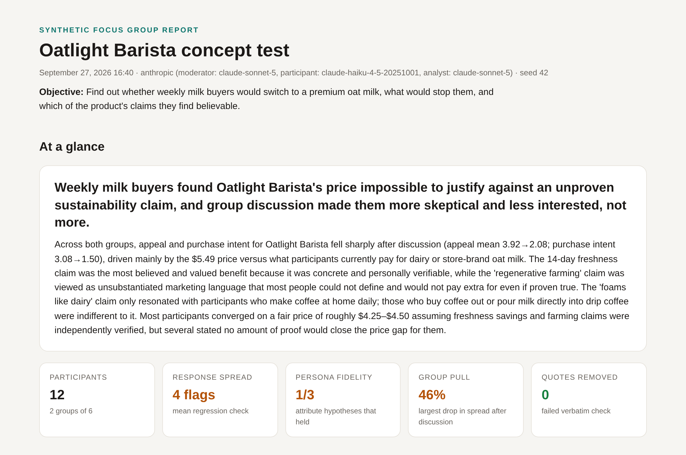
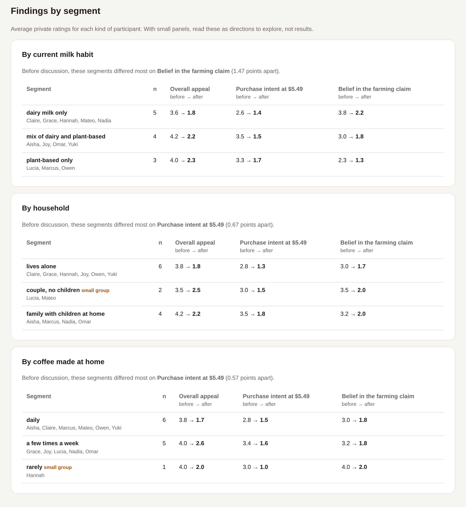
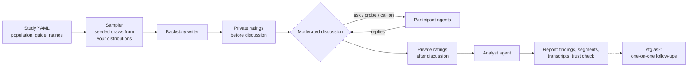

# synthetic-focus-group

Run a focus group with AI participants, then interview any of them one-on-one.

You describe your target population and a discussion guide. The tool samples a panel from that population and runs a moderated group session. The moderator probes vague answers, calls on quiet people, and draws out disagreement. Participants react to each other and sometimes change their minds. You get the themes with real quotes, how opinions moved during the discussion, and findings by segment. Afterward, you can ask any participant a follow-up question.

```bash
pip install -e ".[anthropic]"                          # or ".[openai]" / ".[all]"
sfg run examples/oat-milk-concept.yaml --quick         # 3 people, 1 topic: a cheap first look
sfg run examples/oat-milk-concept.yaml                 # 2 groups of 6, 4 topics
sfg ask runs/<run> -p Omar "Why did your rating drop?" # follow up with anyone
```


<sub>From a live run with Claude (Sonnet 5 as moderator and analyst, Haiku 4.5 as participants). Full report: [`docs/sample-report.html`](docs/sample-report.html); download it and open it in a browser.</sub>

### A moment from that session

> **Moderator:** Omar, what does the regenerative farming claim mean to you, and does it affect whether you'd buy this?
>
> **Omar:** I'm with Claire and Yuki—the word alone doesn't mean anything to me. But here's where I'm different: if they actually *prove* the regenerative piece works, I'd pay the premium because the environmental impact matters enough to me that I'm willing to absorb an extra fifty cents or a dollar. The rest of you seem to need it cheaper first; I just need the data first.
>
> **Moderator:** Several of you mentioned wanting 'data' or 'proof' behind the claim—can you get specific? What exactly would need to be on the carton or verified by whom (a certification logo, a third-party study, a QR code, something else) for you to actually trust it?

Omar's traits were sampled to make him the most receptive buyer in the room, and he acts like it. The moderator then turns the room's vague demand for "proof" into something a product team can act on.

---

## What you get

- **A moderated group discussion.** Transcripts for every group, with a moderator that follows your guide but decides for itself when to probe, whom to call on, and when a topic is covered.
- **Findings.** A headline, themes with how widely each was shared, supporting quotes (each one checked word for word against the transcript), where people split, and open questions.
- **How opinions moved.** Every participant rates the concept privately before anyone speaks and again at the end. You see where the room started and where the conversation took it.
- **Findings by segment.** Ratings broken down by any attribute in your population (current habit, household, region...), sorted so the most divided segment comes first.
- **Follow-up interviews.** `sfg ask` puts a question to one participant or the whole panel. Each interviewee remembers their group's discussion and their own ratings, and knows the rest of the group isn't listening.
- **A trust check.** A short panel at the end of each report flags the known failure modes of synthetic participants, so you know which findings to lean on (details below).


<sub>Findings by segment from the same run. Dairy-only buyers were the most willing to believe the farming claim, and plant-based buyers the least.</sub>

## Why use synthetic participants

Recruiting a real focus group takes weeks and a budget. AI participants take minutes, which makes them useful for:

- testing a concept before investing in real research
- piloting a discussion guide and finding the questions that fall flat
- exploring a segment you can't easily reach
- preparing for fieldwork by knowing which objections to expect

They're a complement to talking to real people, not a replacement.

## Any industry, any panel size

The study file describes who's in the room, so the same tool runs a consumer concept test, a B2B buyer panel, or a session in another language:

| Example | Industry | Panel | Shows |
|---|---|---|---|
| [`oat-milk-concept.yaml`](examples/oat-milk-concept.yaml) | Consumer packaged goods | 2 groups of 6 | Consumer attitudes, pricing, claim believability |
| [`b2b-security-software.yaml`](examples/b2b-security-software.yaml) | B2B software | 2 groups of 5 | Professional roles, company size, buying committees |
| [`small-business-banking-es.yaml`](examples/small-business-banking-es.yaml) | Financial services | 3 groups of 6 | A session run in Spanish, with local names and pesos |

- **Size:** 1 to 50 groups of 3 to 12 people. Groups run as separate sessions at the same time (3 at once by default, set by `max_parallel_groups`), so a large study takes about as long as a few small ones.
- **Large studies:** once the transcripts get long, the analyst reads each group on its own, then combines the findings, so no single call has to hold every transcript.
- **Cost before you run:** `sfg validate` estimates the number of model calls, split by model. On the example study it predicted 255; the live run made 258.
- **Language and names:** set `language` to run the whole session (backstories, discussion, ratings, analysis) in another language, and `names` to give participants names that fit the population.

## How it works



1. **Sampling.** Every attribute (age, income, habits, attitudes) is drawn in code from distributions in the study file, using a fixed seed. The model is never asked to "invent a diverse person." Left to themselves, models tend to produce the same few archetypes, and the panel would stop matching the population you specified.
2. **Personas.** A backstory model adds texture on top of the sampled attributes. Backstories describe each person's life before the session and only mention the product category, never the concept being tested, so nobody arrives already sold on it. Attitudes such as price sensitivity, on a 1 to 7 scale with labeled endpoints, are fixed for the whole session and restated on every turn.
3. **Private ratings, twice.** Participants read the concept up front and rate it privately. After the discussion they rate again, this time with the full discussion in front of them and a reminder of their own first answer. A changed answer reflects the conversation rather than random variation.
4. **Moderated discussion.** The moderator picks one action per turn: `ask_group`, `ask_participant`, `probe`, or `next_topic`. When it puts a question to the whole room, everyone gives a first reaction before hearing the others (as in a real focus group's "write it down first" exercise), and reactions to each other come on the follow-ups.
5. **Analysis.** The analyst writes themes with supporting quotes. Every quote is checked against the transcript word for word. Quotes that don't match are removed, and the removals are counted.

### The model decides, the code guarantees

| The moderator model decides | The code guarantees |
|---|---|
| What to ask, whom to probe, when a topic feels covered | Every participant is heard on every topic |
| How to phrase questions and transitions | Each topic ends within its turn budget |
| Which answers deserve a follow-up | Unknown participant names never break the session |
| What the themes are | Every quote in the report was actually said, by that person |

## Following up with participants

```bash
sfg ask runs/oatlight-...-163334 -p Omar                 # live conversation; empty line to finish
sfg ask runs/oatlight-...-163334 -p Omar -p Claire "What would it take for you to try it once?"
sfg ask runs/oatlight-...-163334 --all "What did you hold back in the group?"
```

Each interviewee answers as the same person, with the same sampled traits and backstory. They remember everything said in their group and how they rated the concept before and after. Interviews are saved in the run folder under `interviews/`. The difference between what someone said in the room and what they say one-on-one is often the most useful finding.

## Trust check

Synthetic participants fail in predictable ways, and a report that doesn't tell you is easy to over-trust. Every run checks for four failure modes:

| Failure mode | What it looks like | How it's measured |
|---|---|---|
| **Answers cluster near the middle** | Twelve people who look different on paper all answer "4" | Spread of opening ratings and the share taken by the most common answer. With real survey data supplied: how the synthetic spread compares with the human one |
| **Traits that don't matter** | Price-sensitive personas are as keen on a premium product as anyone else | For each link you predict in the study file, the rank correlation between the trait and the opening rating |
| **Group pull** | Everyone converges after hearing the loudest voice | How much each group's spread shrinks from before to after the discussion |
| **Quotes nobody said** | The analyst tidies up a quote or attributes it to the wrong person | Word-for-word matching of every quote against what that participant said |

The thresholds are heuristics that flag findings worth a closer look, not significance tests. **[How the trust check shaped this tool](docs/case-study.md):** on the first live run it caught participants echoing whoever spoke first, which led to the independent-first-reaction design above.

## Quickstart

```bash
git clone https://github.com/kotharisaahil/synthetic-focus-group
cd synthetic-focus-group
python -m venv .venv && source .venv/bin/activate
pip install -e ".[all,dev]"

sfg validate examples/oat-milk-concept.yaml     # check the study file and estimate model calls
sfg personas examples/oat-milk-concept.yaml     # preview the sample: free, no model calls
sfg run examples/oat-milk-concept.yaml --mock   # offline end-to-end run

cp .env.example .env                            # add ANTHROPIC_API_KEY or OPENAI_API_KEY
sfg run examples/oat-milk-concept.yaml --quick  # preflight: every agent, a few cents
sfg run examples/oat-milk-concept.yaml --provider anthropic
sfg run examples/oat-milk-concept.yaml --provider openai --groups 1 --size 5

sfg ask runs/<run folder> -p <name>             # interview a participant
sfg report runs/<run folder>                    # re-render a report (no model calls)
```

Each run writes a folder under `runs/`:

| File | Contents |
|---|---|
| `report.html` | Self-contained visual report: findings, themes, how opinions moved, findings by segment, participants, transcripts, trust check, method |
| `report.md` | The same findings in Markdown |
| `transcript.md` | Full speaker-labeled transcript, including guardrail interventions |
| `data.json` | Everything structured: personas, ratings, turns, analysis, segments, trust metrics, token usage |
| `calls.jsonl` | Every model call with its prompt, response, model, and latency |
| `interviews/` | Follow-up interviews from `sfg ask`, one Markdown file each |

Always do a `--quick` preflight before a full run. It runs one group of 3 through the first topic, including the analyst, so a wrong model name, a missing key, or a token-limit problem shows up for a few cents instead of after hundreds of calls.

The example study (2 groups of 6, 4 topics) makes about 260 model calls. Most go to the smaller participant model. Backstories and private ratings run in parallel. After each run, the terminal and the report's Method section show calls and tokens per model, so you can see what the run cost. The run folder is created as soon as a run starts and its call log fills in live, so you can watch progress with `wc -l runs/*/calls.jsonl`. If a run fails partway (for example, a mistyped model name or a rate limit), the folder is kept with a `-failed` suffix so you can see exactly where it stopped. The `.env` file is found in the current directory or next to the study file.

## Writing a study

A study is one YAML file. See [`examples/oat-milk-concept.yaml`](examples/oat-milk-concept.yaml) for a complete one.

```yaml
title: Oatlight Barista concept test
objective: Find out whether weekly milk buyers would switch to a premium oat milk...
category: milk and plant-based milk, especially for coffee at home   # used for backstories
stimulus: Oatlight Barista is a new oat milk made for coffee...        # what participants react to
# language: Spanish         # optional: run the whole session in another language
# names: [Sofía, Carlos, ...]  # optional: names that fit the population

groups: 2
group_size: 6
seed: 42

population:
  - name: household_income
    type: lognormal          # uniform | normal | lognormal | categorical | scale
    median: 78000            # lognormal takes plain terms, not log-space parameters
    p90: 175000
    unit: USD
  - name: price_sensitivity
    type: scale              # a fixed attitude, restated every turn
    mean: 4.2
    sd: 1.6
    low_label: buys on quality and rarely checks the price
    high_label: always checks unit prices and switches for small savings

ratings:
  - id: purchase_intent
    question: How likely would you be to buy Oatlight Barista at $5.49 in the next month?
    low_label: definitely would not
    high_label: definitely would
    expect:                  # a testable link between a trait and this rating
      - attribute: price_sensitivity
        direction: negative

guide:
  - title: Price and value
    question: It costs $5.49, about $1.50 more than the leading oat milk. How does that land?
    probes: [Does the 14-day freshness change the math for you?]
    max_turns: 9

models:
  provider: anthropic        # anthropic | openai | mock
  # max_parallel_groups: 3   # groups that run at the same time
  # max_parallel_calls: 4    # backstories and rating cards run concurrently within a group
  # moderator: claude-sonnet-5            (optional per-role overrides)
  # participant: claude-haiku-4-5-20251001
```

Validation is strict. Categorical percentages must total 100, predicted links must point to numeric attributes, and unknown fields are rejected. A broken population spec fails before any model is called, instead of quietly producing a meaningless sample.

### Comparing against real survey data

If you have real response distributions for any rating item (from your own past surveys or a public dataset), put them in a CSV and set `benchmark: path/to/file.csv` in the study:

```csv
item_id,value,share
purchase_intent,1,0.12
purchase_intent,2,0.10
...
```

Shares can be proportions or percentages. The report then shows how the synthetic spread compares with the human one, and how far apart the two distributions are. That's the most direct check for answers clustering near the middle. A blank template is in [`examples/benchmark.template.csv`](examples/benchmark.template.csv).

## Design decisions

- **Distributions live in code, not in prompts.** Sampling in code is the only way to guarantee the panel matches the population you specified, and a fixed seed makes it reproducible.
- **Traits are labeled scales, not bare numbers.** "Price sensitivity: 6" means little to a model. "6 on a 1 to 7 scale, where 7 = always checks unit prices" gives it something to act on.
- **Opening ratings are collected before the discussion.** Without a before-and-after comparison, you can't tell a real consensus from the group pulling everyone together.
- **The second rating card carries the whole discussion.** Each model call starts fresh, so a participant only "remembers" what the prompt contains. Giving the second card the full transcript and the person's first answer is what makes the before-and-after comparison measure the conversation. These are the largest calls in a run.
- **Only independent calls run in parallel.** Backstories and private ratings run concurrently. The discussion stays sequential, because each reply depends on what was said before it.
- **Every call is logged.** `calls.jsonl` holds the exact prompt behind every line in the report, so any run can be audited.
- **Token limits are ceilings, and they escalate.** Newer models can spend part of their output budget on hidden reasoning before writing anything visible. If a reply comes back empty or cut off at its limit, the next attempt doubles the limit, instead of retrying the same failure. You are billed for tokens used, not for the ceiling.
- **There is an offline mode.** The mock provider exercises every code path, which keeps the test suite fast, free, and deterministic.

## Limitations

- Synthetic participants reflect what a model has learned about people, including its blind spots and stereotypes. Use them to sharpen hypotheses and pilot discussion guides, not as a replacement for real respondents.
- The trust check detects known problems. They can't prove a run is right. A clean report means "no red flags found," not "validated."
- The trait checks only test the links you predict. With small panels (6 to 12 people), the correlations are noisy, so read them as directional.
- The second rating card reminds participants of their first answer. That keeps changes deliberate rather than random, but it may also make people stick to their answer more than they would in a real room.
- Group pull is real: after a mostly negative discussion, nearly everyone lowers their rating, even participants who argued the other side. Treat post-discussion ratings as the room's influence, not independent opinions. The [case study](docs/case-study.md) has the numbers.
- Participants each see recent discussion plus their own earlier statements, not the whole session, so long sessions can lose some continuity.
- Non-English sessions are only as good as the model's command of that language, and personas can still carry the model's assumptions about a culture. Review a transcript before trusting findings from a new market.
- The study file, including your concept description, is sent to the model provider. Don't put anything in it you couldn't share with that provider.
- Temperature is only applied where the provider accepts it. The current Anthropic SDK (1.x) and OpenAI's reasoning models don't, so on those, variety between participants comes entirely from their sampled traits and fixed attitudes.

## Project layout

```
src/sfg/
  config.py     study schema and validation
  sampling.py   seeded population draws
  personas.py   persona construction and backstories
  agents.py     participant, moderator, and analyst agents; guardrails; quote verification
  session.py    orchestration: ratings, discussion, analysis
  segments.py   findings by segment
  interview.py  one-on-one follow-ups with participants from a finished run
  metrics.py    trust check
  report.py     HTML / Markdown / JSON output
  llm.py        provider adapters, retries, JSON handling, call log
  mock.py       offline provider for tests and demos
  cli.py        sfg validate | personas | run | ask | report
tests/          sampling, config, agents, metrics, segments, interviews, CLI, end-to-end mock runs
```

```bash
pytest -q
```

## Background

The idea of using language models as stand-ins for survey respondents is studied in Argyle et al., *Out of One, Many: Using Language Models to Simulate Human Samples* (Political Analysis, 2023). Two findings from that line of work shaped this tool: how you condition a synthetic respondent matters a lot, and synthetic answers should be checked against real ones rather than trusted by default.

## License

MIT
