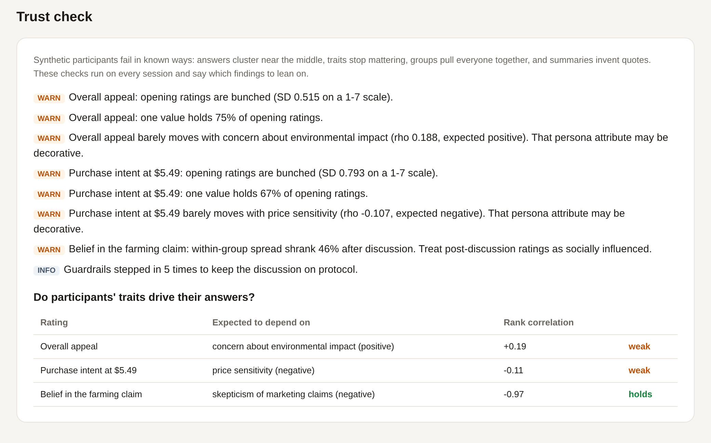
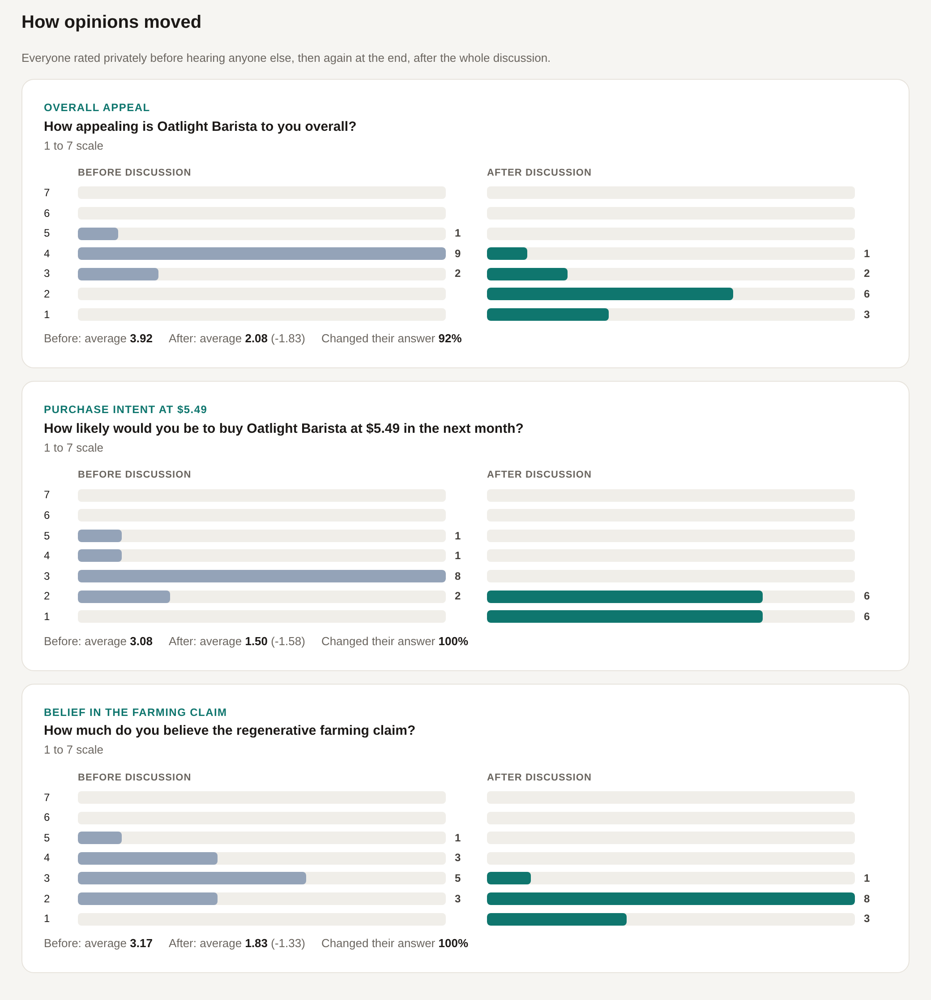

# Case study: what the first live runs showed

The example study (a concept test for a premium oat milk, 2 groups of 6) was run live with Claude: Sonnet 5 as moderator and analyst, Haiku 4.5 as participants. The first runs produced a readable focus group, and the trust check caught problems the rest of the report would have hidden.

## Run 1: a good-looking session with real problems underneath

The discussion read well. The moderator probed specifics ("You said it feels like they're banking on people feeling guilty. Can you say more?") and noticed early consensus. But the trust check flagged 7 problems:

- 75% of participants gave the same answer on belief in the farming claim.
- Price sensitivity barely affected purchase intent (rho -0.20), and skepticism barely affected belief in the claim (rho -0.11). The personas' attitudes were decorative.
- The analyst produced 2 quotes nobody said. They were caught and removed.

The transcript showed why. When the moderator asked the whole group a question, each person heard the earlier answers before giving their own, so the first speaker set the frame and everyone echoed it. The clearest case was Omar. His sampled attitudes (low price sensitivity, high environmental concern, low skepticism) made him the natural buyer, yet he opened with "I'm with Owen and Yuki."

## The fix

Real moderators handle this with a technique called nominal group: everyone writes down a first reaction before anyone speaks. Group questions now work the same way. Everyone answers from the same starting point, and reactions to each other come on the follow-ups.

Three smaller changes went in alongside it:

- Each participant's fixed attitudes are restated on every turn and on every rating card.
- Replies are capped at about 60 words, with an instruction to add something new rather than agree.
- The moderator is told that code already guarantees everyone gets heard, so its turns should go to depth.

## Run 2

| | Run 1 | Run 2 |
|---|---|---|
| Median reply length | 109 words | 54 words |
| Invented quotes removed | 2 | 0 |
| Belief in the claim tracks skepticism (rho) | -0.11 | -0.97 |
| Share giving the most common answer on belief in the claim | 75% | 42% |
| Purchase intent tracks price sensitivity (rho) | -0.20 | -0.11 |
| Participants who changed their answer after discussion | 92 to 100% | 92 to 100% |
| Input tokens (Haiku / Sonnet) | 663k / 182k | 484k / 127k |

Omar now behaves like the person he was sampled to be. His opening ratings were the highest in the room, and he broke from the group out loud: "Here's where I'm different... the rest of you seem to need it cheaper first; I just need the data first."

## What didn't improve

- **Group pull is still strong.** After reading a mostly skeptical transcript, every participant lowered their ratings, Omar included, even though he'd just said he would pay the premium with proof. Language models defer to a clear majority, and prompting alone didn't fix that.
- **Price sensitivity still doesn't move purchase intent.**
- **The claim-belief result may be partly built in.** Rating cards now restate each person's skepticism score, which makes it easier for the model to follow the number.

These are open problems. The report flags them on every run rather than hiding them.

